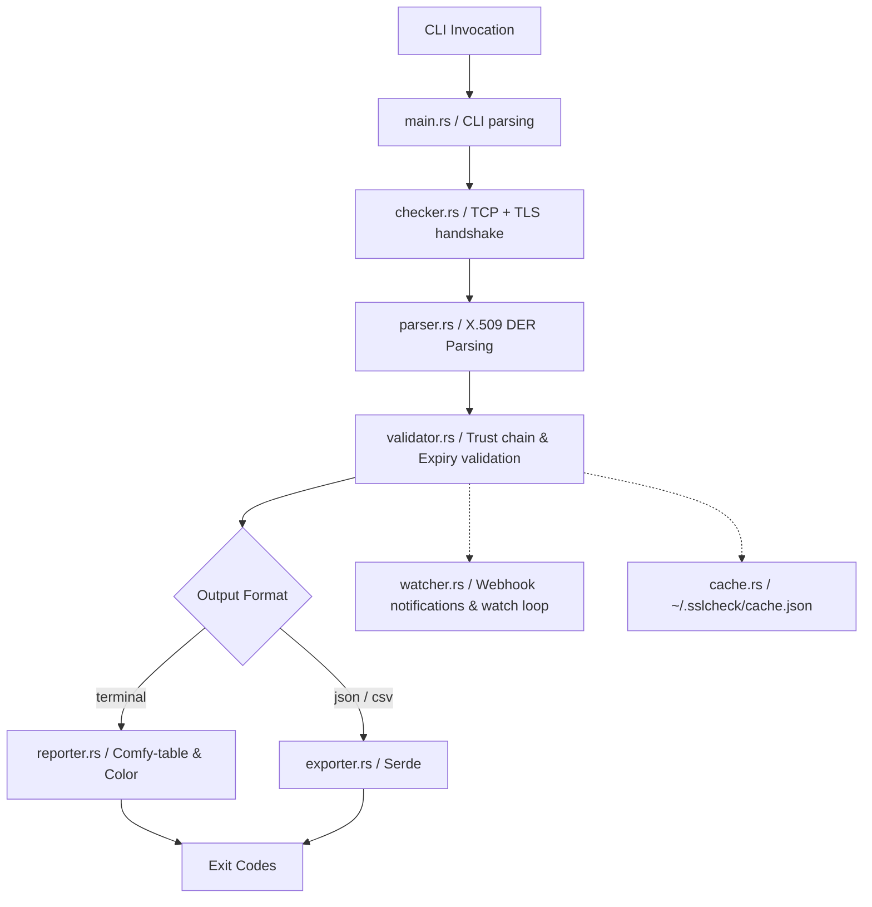

# Project Summary: `sslcheck` (SSL Certificate Checker CLI)

`sslcheck` is an open-source, terminal-based SSL/TLS certificate auditing tool designed for developers, DevOps engineers, and security teams. It connects to domains over TLS, extracts the certificate chain, and prints a structured, color-coded report or outputs machine-readable data (JSON/CSV).

---

## 1. High-Level Architecture

The project is built primarily in **Rust** (stable toolchain, MSRV: 1.75) for the final production binary, with a parallel **Python** prototype for rapid experimentation.



### Module Breakdown
*   **`main.rs`**: Entrypoint, parses CLI arguments (via `clap 4`), routes tasks, and sets process exit codes.
*   **`checker.rs`**: Opens TCP sockets and performs TLS handshakes (using `rustls 0.23`) to extract raw peer certificates without performing a full HTTPS request.
*   **`parser.rs`**: Parses X.509 DER certificate bytes (via `x509-parser 0.16`) to extract metadata.
*   **`validator.rs`**: Handles trust-chain verification, expiration math, and TLS version compliance.
*   **`reporter.rs`**: Renders human-readable colored terminal output using `comfy-table` and `colored`.
*   **`exporter.rs`**: Serializes certificate information to JSON/CSV (via `serde`).
*   **`batch.rs`**: Manages asynchronous multi-domain checks concurrently (via `Tokio`).
*   **`watcher.rs`**: Handles watch-mode scheduling and HTTP webhook notifications.
*   **`cache.rs`**: Interacts with `~/.sslcheck/cache.json` to store seen fingerprints for tamper-detection.

---

## 2. Core Data Flow

When a user runs `sslcheck <domain>`, the application performs the following steps:

1.  **Parse Arguments**: CLI input is parsed into a `CheckConfig` structure.
2.  **TCP Connection & TLS Handshake**: Establishes a TLS connection to the domain. The remote server responds with its certificate chain, which is intercepted and collected.
3.  **Parsing DER Certificates**: The binary decodes the certificate chain into a vector of parsed certificates.
4.  **Validation**: Calculations determine trust state, expiry warnings, and TLS protocol features.
5.  **Output & Export**: The result is formatted either as a terminal table or raw serialized files (JSON/CSV).
6.  **Exit Mapping**: The program returns an exit code representing the certificate's status:
    *   `0`: Healthy
    *   `1`: Expiring soon (configurable threshold, default: 30 days)
    *   `2`: Expired or invalid
    *   `3`: Network / DNS error

---

## 3. CLI Command Options

The command-line syntax follows POSIX conventions:
```bash
sslcheck [OPTIONS] <DOMAIN>
```

### Key Options
*   `-p, --port <443>`: Target port for TLS handshake.
*   `-w, --warn-days <30>`: Expiry threshold in days to trigger warning exit code `1`.
*   `-f, --file <path>`: Batch mode targeting a newline-delimited domain file.
*   `-o, --output <terminal>`: Renders as `terminal`, `json`, or `csv`.
*   `-c, --concurrency <5>`: Concurrency limit for batch-mode checks.
*   `--watch`: Enables scheduled polling and alert triggering.
*   `--webhook`: Webhook URL for watch-mode notifications.

---

## 4. Key Libraries & Dependencies

*   **Async Runtime**: Tokio
*   **TLS Engine**: `rustls 0.23` (pure Rust, avoiding OpenSSL system requirements)
*   **System Store**: `rustls-native-certs` (loads local operating system trust anchors)
*   **Cert Parsing**: `x509-parser`
*   **CLI Framework**: `clap 4` (with derive macros)
